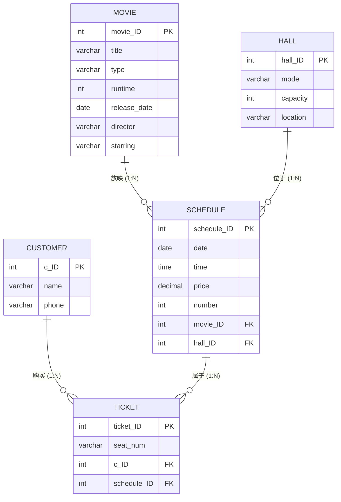

```mermaid
erDiagram
    CUSTOMER ||--o{ TICKET : "购买 (1:N)"
    SCHEDULE ||--o{ TICKET : "属于 (1:N)"
    MOVIE ||--o{ SCHEDULE : "放映 (1:N)"
    HALL ||--o{ SCHEDULE : "位于 (1:N)"

    MOVIE {
        int movie_ID PK
        varchar title
        varchar type
        int runtime
        date release_date
        varchar director
        varchar starring
    }

    CUSTOMER {
        int c_ID PK
        varchar name
        varchar phone
    }

    HALL {
        int hall_ID PK
        varchar mode
        int capacity
        varchar location
    }

    SCHEDULE {
        int schedule_ID PK
        date date
        time time
        decimal price
        int number
        int movie_ID FK
        int hall_ID FK
    }

    TICKET {
        int ticket_ID PK
        varchar seat_num
        int c_ID FK
        int schedule_ID FK
    }
```

